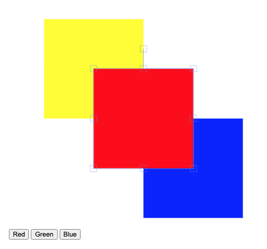

## Instructions

** Please don't fork this repo, because then other candidates will see your solution :) **

1. Clone repo
2. Complete the task
3. Upload to your repository and send us the link

## Task

### Add UI buttons that change the background color of the selected object

#### Purpose

Modify the app so that when object(s) are selected on the canvas three buttons
are displayed that allow you to change the background color (`fill`) of the
selected object(s).

The buttons should be implemented with React.

The buttons should not be visible when nothing is selected on the canvas.

You are welcome to refactor code or add packages as you see fit.

#### Other requirements

- Your code must compile and run in a modern browser (e.g. Chrome v80+) without any errors

## Information on the frameworks used

- React >= 16.12
- Fabric.js >= 3.5

## Project launch

1. `$ npm install`
2. `$ npm run start`
3. [http://localhost:3000](http://localhost:3000).
